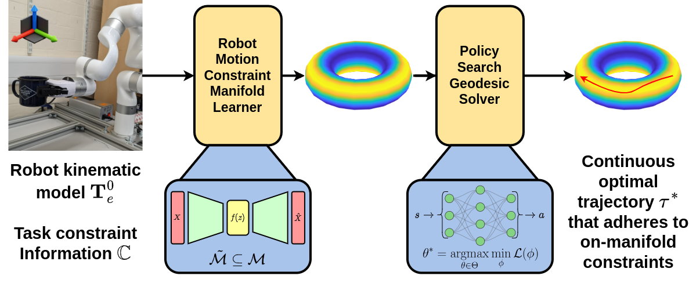
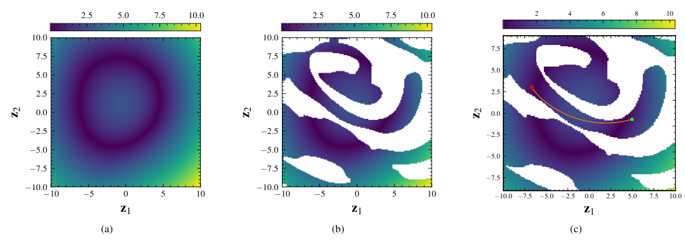

# Generating Continuous Paths On Learned Constraint Manifolds Using Policy Search

[](http://creativecommons.org/licenses/by/4.0/])

<p align="center">
  
</p>

This repo is to act as a supplement to the work provided in our paper titled ***"Generating Continuous Paths On Learned Constraint Manifolds Using Policy Search"***. It is not designed to be production-level code, rather to inform readers as to our methodology.

This will continued to be updated as it is an ongoing piece of research.  

**UPDATE 30/06/2024:** Our paper was accepted to IEEE/RSJ IROS 2024!

## Usage

### Prerequisites

We provide an ```environment.yml``` file that includes all of our packages. This has been tested in Python 3.11.5 on a system with the following specs:

```shell
OS: Ubuntu 22.04 LTS
Python Version: 3.10.10
GPU: NVIDIA GeForce RTX 3080
CPU: Intel Core i9-10920X 12C/24T
RAM: 64 GB
```

Our implementation is built upon two other implementations of proximal policy optimisation (PPO) and latent space manifolds. Our PPO implementation is adapted from that by [Nikhil Barhate](https://github.com/nikhilbarhate99/PPO-PyTorch) and our latent space manifold implementation is adapted from the work in the paper ['Learning Riemannian Manifolds for Geodesic Motion Skills'](https://doi.org/10.15607/RSS.2021.XVII.082) by Beik-Mohammadi et al. and their implementation provided [here](https://github.com/boschresearch/GeodesicMotionSkills).

Some prerequisities not included in the environment file are the packages `stochman` and `s-vae-pytorch`. The full details for how to install these can be found in the [GeodesicMotionSkills](https://github.com/boschresearch/GeodesicMotionSkills) repository, which we have added here for convenience.

```shell
# Clone our repository
git clone git@github.com:boschresearch/GeodesicMotionSkills.git

# Clone Stochman from here (in the same directory)
git clone https://github.com/MachineLearningLifeScience/stochman
cd stochman/
git checkout 1d092e0dffef179b706542f0693b813a8370fcf8
cd ..

# Clone hyperspherical vae from here (in the same directory)
git clone https://github.com/hadibeikm/s-vae-pytorch.git
```

We recommend using a virtual environment such as virtualenv or Anaconda. We used Anaconda during our testing and will refer to the instructions as follows. To install and configure the environment, run:

```shell
cd geodesic-planner

# Create the environment
conda env create -f environment.yml

# Navigate to the hyperspherical VAE repo and install
cd ../s-vae-pytorch
pip install -e .

# Navigate to the stochman repo and install
cd ../stochman
pip install -e .
```

Once this is done, you can return to our repo to run the code. 

### Training the Constraint Manifold

For training the manifold planner, we provide two sets of options. The first is a predefined shell script that allows some granularity with selecting options for training. You can run this script from the home directory of this repository. First give the script executable privileges on Ubuntu:

```shell
sudo chmod +x train_manifold.sh
```

Then run the script:

```shell
./train_manifold.sh -m <mode> -b <batch size> -d <num datapoints>
```

The `mode` parameter dictates whether the model is just training, testing or both. Batch size is the size of the update batches for PyTorch and the number of datapoints that are used to train the VAE manifold.

For more documentation regarding the training variables, please find the variables within the code for their explanation. Further explanation can be found in the work by [Beik-Mohammedi et al.](https://github.com/boschresearch/GeodesicMotionSkills)

### Training the Geodesic Planner

Similar to the manifold learner, our manifold planner contains a single script file that can be used to run the planner with the default settings. First make the shell script executable:

```shell
sudo chmod +x train_geodesic.sh
```

Then you can run the script:

```shell
./train_geodesic.sh -e <episodes> -p <path> -r <rep>
```

Where `episodes` is the number of learning epochs to undergo for the policy optimisation, `path` is the save path for the model weights and `rep` determines the repitition number for this training cycle.

When the training has finished, the results can be plotted as shown below which is available in the paper. It shows the learned manifold with the sub-manifold constraint applied, then the learned shortest geodesic.

<p align="center">
  
</p>
