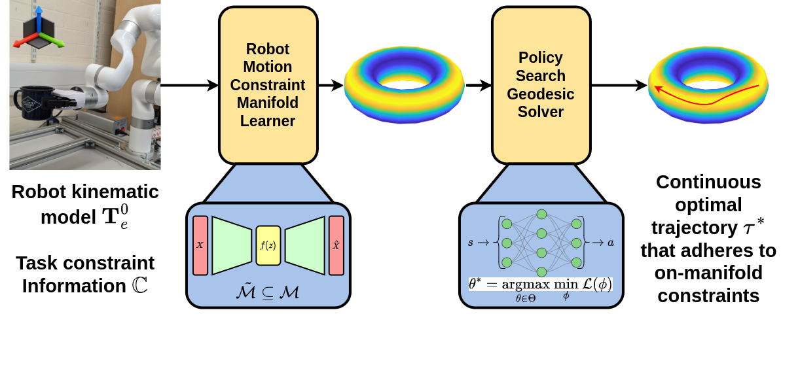

# Generating Continuous Paths On Learned Constraint Manifolds Using Policy Search

  

<object data="assets/paper-model-crop.pdf" type="application/pdf" width="700px" height="700px">
    <embed src="assets/paper-model-crop.pdf">
        
This browser does not support PDFs.

    </embed>
</object>

This repo is to act as a supplement to the work provided in our paper titled ***"Generating Continuous Paths On Learned Constraint Manifolds Using Policy Search"***. It is not designed to be production-level code, rather to inform readers as to our methodology.

**UPDATE (Date here):** Our work was accepted to IEEE/RSJ IROS 2024!
